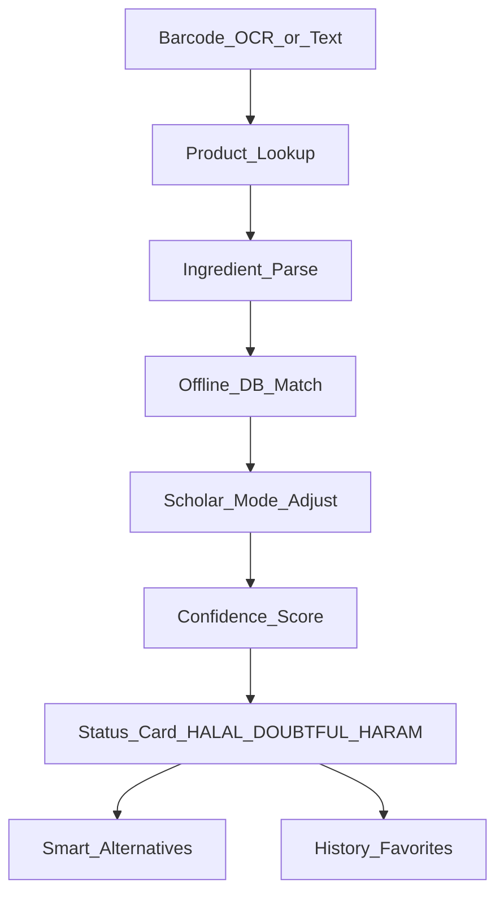

# Halal Detector Architecture

## Stack

- **Mobile:** React Native (Expo) — Android & iOS, large-type accessibility UI
- **Backend:** FastAPI (Python) — analysis APIs, history/favorites, restaurant & chat helpers
- **Database:** SQLite by default (swap `DATABASE_URL` to PostgreSQL/`asyncpg` in production)
- **Auth (pluggable):** Guest mode shipped; Firebase Auth ready to wire for synced profiles
- **Product data:** Open Food Facts barcode API + local demo catalog
- **Offline:** Bundled ingredient JSON (E-numbers, animal derivatives, alcohols, enzymes)

## Monorepo layout

```
halal-detector/
  mobile/          # Expo app
  backend/         # FastAPI service
  data/            # Shared offline ingredient + certification DB
  docs/            # Product & architecture docs
```

## Analysis pipeline



## Status rules

1. Verified pork / carmine / explicit haram → **Haram**
2. Unknown origin additives (natural flavors, E471, gelatin) → **Doubtful**
3. Known plant / accepted additives → **Halal**
4. Missing data → **Doubtful** with low confidence
5. App never presents results as a fatwa; scholarly differences are labeled explicitly

## Data sources (extensible)

| Source | Use |
|--------|-----|
| Open Food Facts | Barcode product + ingredients + nutrition |
| Local `ingredients.json` | Offline E-numbers & rulings metadata |
| Certification registry | JAKIM, MUI, IFANCA, HMC, HFA, HFSAA, SANHA |
| Optional OpenAI key | Richer NLP explanations when configured |

## Security

- HTTPS in production
- Rate limiting hook (`slowapi` ready)
- No absolute religious claims stored as facts vs interpretation separation in API payloads
- User history encrypted in transit; local AsyncStorage on device; Firebase/Postgres for cloud sync
